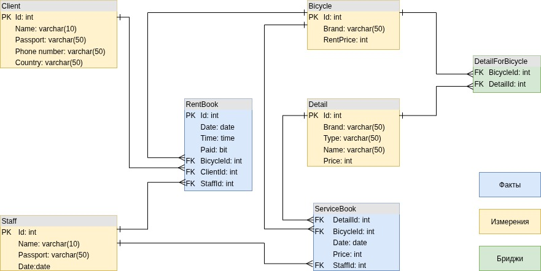
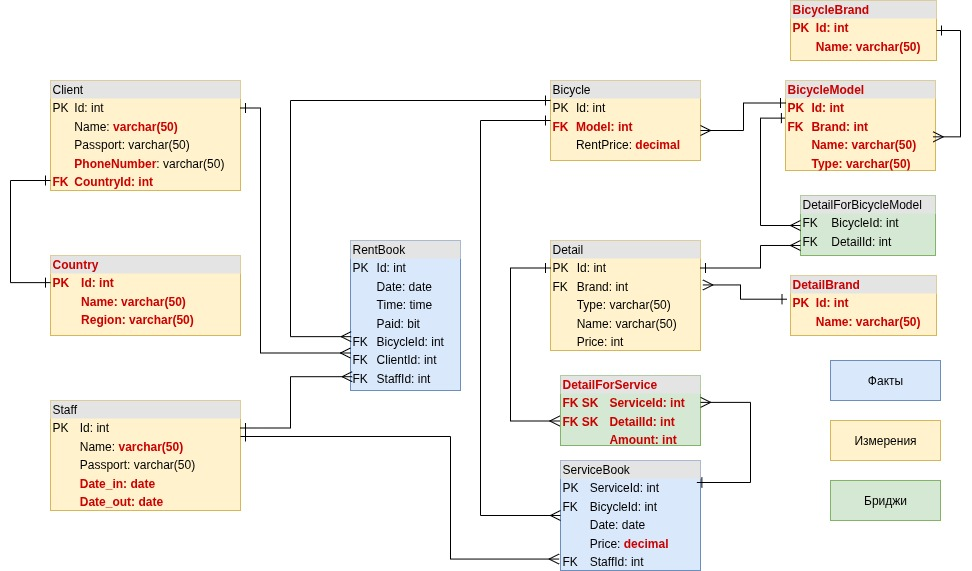

# Тестовое задание по направлению Data Engineer


## Анализ предложенного хранилища данных

Хранилище данных представляет собой созвездие по Кимбаллу, где `RentBook` и `ServiceBook` являются таблицами фактов, 
а `Client`, `Staff`, `Bicycle`, `Detail` - таблицами измерений. `DetailForBicycle` представляет собой `bridge table` 
для `M-to-M`:



### Недостатки модели:

#### Критические:
* Все поля `Name` обозначены как `varchar(10)`, этого количества зарезервированных знаков не достаточно.
* Поля, для хранения информации о денежных суммах в формате `int`, это не позволяет хранить копейки, центы и т.д.
* В таблице `Staff` нет даты увольнения или поля, по которому можно отличить действующих и выбывших сотрудников. 
  Подразумеваем, что у нас OLAP система, и выборочно удалять записи мы не можем.

#### Средние:
* Поля, содержащие названия стран, бренды принимают `varchar(50)` напрямую. Пользователь может внести, например `UK`,
  `United Kingdom`, что приведет к ошибкам в выборке. Среди брендов так же возможны варианты `GT`, `GT Bycycles`. 
* Таблица `ServiceBook` и её взаимодействие с `Detail`: если нужно заменить 3 спицы и одну педаль, это 4 записи по 
  одному акту выполнения работ. Это непримелемо.
* Связь `Detail` с `Bicycle`: Если рент-сервис закупает 20 велосипедов одной модели, нужно вносить (20 * кол-во 
  подходящих деталей) записей в `DetailForBicycle`.

#### Незначительные:
* Атрибут `Phone number` таблицы `Clients` нарушает стилистику `PascalCase` в названиях.



### Внесенные изменения:

* Все поля `Name` расширены до `varchar(100)` для сущностей, описывающих людей.
* Поля `Price` теперь имеют тип данных `decimal(10, 2)`. Специализированный тип `money` в нашем случае избыточен, т.
  к. мы работаем и принимаем оплату в пределах одной территории (судя по модели), и он затрудняет возможные миграции.
* В таблице `Staff` теперь есть дата приема и дата увольнения (`date_in`, `date_out`, где `date_out` 2099 года 
  обозначает действующего сторудника, это позволит делать выборки по сранению текущей или заданной даты с датой в поле).
* Созданы справочники для стран и брендов - `Country`, `Brand`.
* Связь `ServiceBook`  и `Detail` - теперь `M-to-M`, бридж содержит информацию о количестве одноименных деталей для 
  акта работы, поэтому стало необходимо внести `суррогатный ключ` из двух полей.
* Связь `Detail` и `Bicycle` теперь осуществляется не напрямую, а через `BicycleModel`. 
* Переименовал атрибут `Phone number` в `Clients`

### Другое:
* Заметил разбиение даты на 2 поля, погуглил, оказывается это приемлемый паттерн в MS SQL. Непривычно.
* Названия таблиц на каноничные с префиксами `dim_`, `fct_`, `brg_` тоже менять не стал. В этом масштабе и так понятно.

## Структура проекта:
* `backup/` - директория хранения бэкапов
* `readme_static/` - директория для хранения статики для README
* `scripts/` - основная директория для хранения скриптов
  * `mock_data/` - скрипты заполнения БД мок-данными
  * `tables/` - скрипты создания таблиц, где порядок запуска: 
    * `create_original_tables.sql` - оригинальные таблицы из задания
    * `my_fixes.sql` - мои изменения в структуру таблиц
    * `employee_bonus_dashboard` - дашборд для второго задания
  * `procedures/` - директория для хранения процедур
    * `employee_bonus.sql` - создание процедуры
    * `employee_bonus_usage.sql` - использование процедуры


## Запуск проекта:

### Запустите инстанс MSSQL Server
  
  Отредактируйте `docker-compose.yml`, если хотите изменить учетные данные.

  Находясь в корневой папке проекта введите команду в терминале:
  ```bash
  docker compose up -d
  ```
  
  Далее потребуется id контейнера:

```bash
  docker ps
  ```
  Поместите бэкап в адресное пространство контейнера
  ```bash
  docker cp <container_id>:/var/opt/mssql/backup/master.bak ./
  ```
  Зайдите в среду выполнения команд контейнера
```bash
docker exec <container_id> /opt/mssql-tools18/bin/sqlcmd -S localhost -U sa -P <SA_PASSWORD> -C -Q "RESTORE DATABASE 
[master] FROM DISK = '/var/opt/mssql/backup/master.bak' WITH REPLACE"
```

## Комментарии к заданию:
### Ответить на вопрос: Какими методами можно автоматизировать процесс загрузки витрины на ежедневной основе?
  Я бы использовал для этого единый scheduler вроде Airflow, чтобы все таски, выполняемые по расписанию для проекта, 
  хранились в 
  одном месте.
